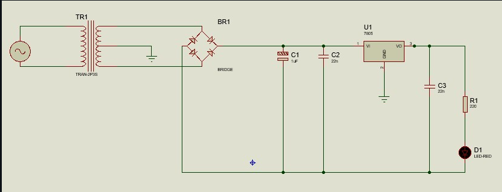
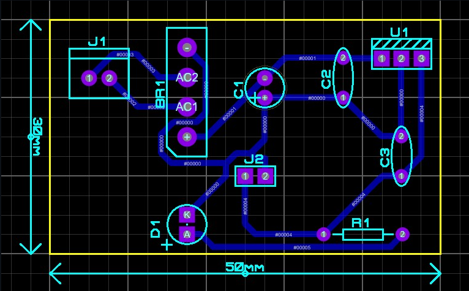
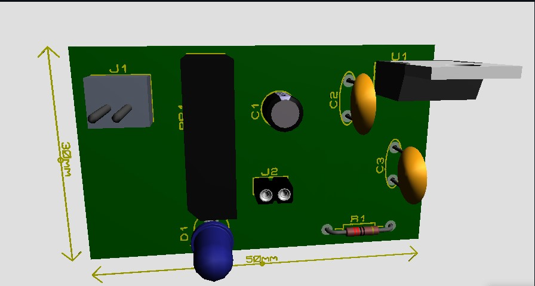
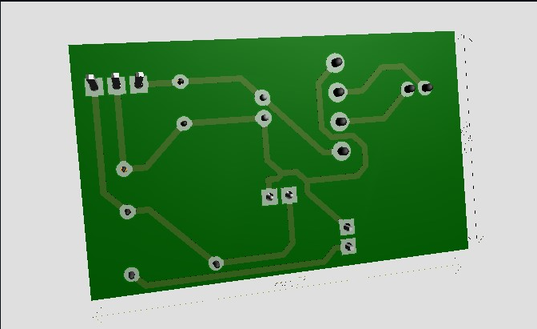
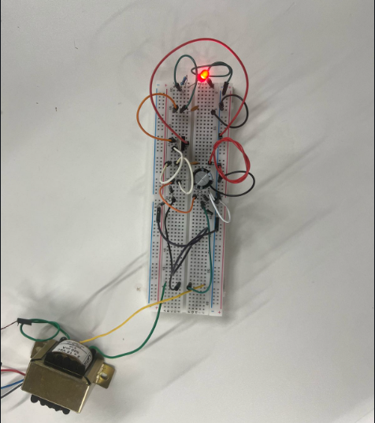
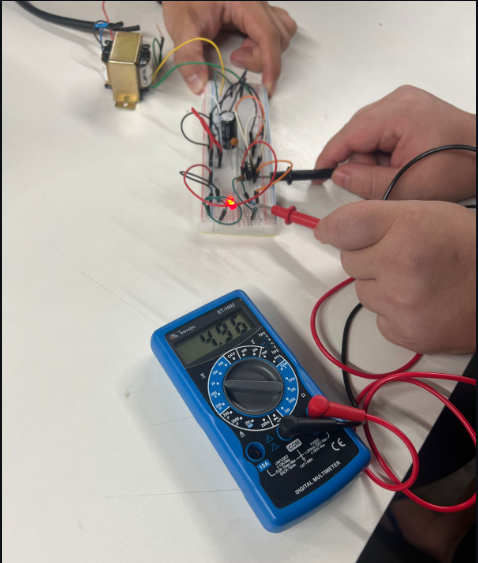
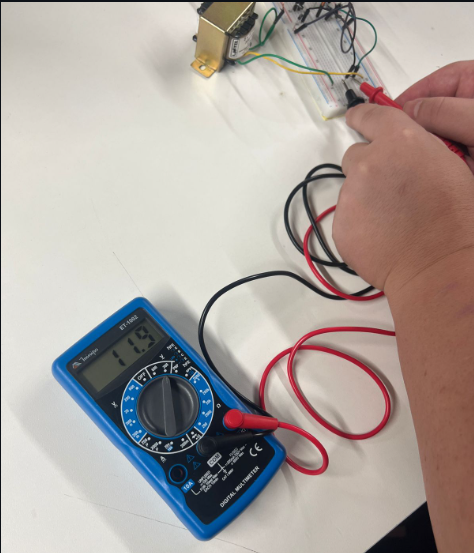

Trabalho - Sistemas Embarcados

-------------------------------------------------------------------------------
🔌 Projeto de Fonte 5V com 7805 desenvolvido na disciplina de Sistemas Embarcados utilizando Proteus 8 Professional.
Dividido em 4 etapas (Esquemático, PCB, 3D e Prática)
 
O projeto consiste num circuito de fonte de alimentação regulada de 5V com um LED indicador de saída

🎯 O objetivo desse circuito é converter corrente alternada (AC) da rede elétrica em corrente contínua (DC) estabilizada de 5V para alimentar dispositivos eletrônicos.

-------------------------------------------------------------------------------

🎯 Funcionamento do Circuito

Transformador (TR1):
→ Reduz a tensão da rede elétrica (exemplo: 110V ou 220V AC) para um nível mais baixo, como 9V ou 12V AC.

Ponte Retificadora (BR1):
→ Converte a tensão alternada (AC) em tensão contínua pulsante (DC).
→ É composta por quatro diodos conectados em ponte.

Capacitores de Filtro (C1, C2, C3):
→ C1 (1µF) e C2 (22nF): Ajudam a suavizar a tensão pulsante da ponte retificadora, reduzindo oscilações.
→ C3 (22nF): Atua como estabilizador da saída de 5V, ajudando a reduzir ruídos na alimentação.

Regulador de Tensão (U1 - 7805):
→ Um regulador linear de 5V que recebe uma tensão maior (exemplo: 9V ou 12V DC) e estabiliza em 5V DC na saída.
→ Tem três pinos: entrada (VI), terra (GND) e saída (VO).

Resistor (R1 - 220Ω) e LED (D1 - Vermelho):
→ O LED serve como indicador de funcionamento, acendendo quando há 5V na saída.
→ O resistor R1 limita a corrente para evitar que o LED queime.

-------------------------------------------------------------------------------

📘 Esquemático
📷 Diagrama Elétrico do Circuito (criado no Proteus 8) :

🔌 Explicação:

#### → J1 recebe a tensão AC do transformador
#### → A ponte retificadora (BR1) converte AC em DC pulsante
#### → O capacitor C1 realiza a filtragem inicial
#### → C2 e C3 atuam como filtros de alta frequência próximos ao 7805
#### → A saída do 7805 alimenta o LED (D1) com o resistor R1
#### → J2 disponibiliza saída regulada de 5V

-------------------------------------------------------------------------------

🧩 PCB
📐 Layout da Placa de Circuito Impresso (criado no Proteus 8):

📌 Características do Circuito

✔ Dimensões da PCB: 50mm x 30mm
✔ Tipo: Fonte de alimentação linear regulada de 5V DC
✔ Entrada: Tensão AC (geralmente 9V ou 12V)
✔ Saída: 5V DC estabilizados
✔ Capacidade de corrente: Até 1A (dependendo do dissipador de calor do 7805)
✔ Filtragem: Capacitores para redução de ruído e estabilização
✔ Indicação de funcionamento: LED indicador na saída
✔ Regulação: Utiliza o regulador 7805 para manter a tensão de saída constante
✔ Proteção: O 7805 possui proteção contra sobrecarga e superaquecimento
✔ Trilhas de alta corrente: Trilhas mais largas para suportar a corrente da entrada AC até a saída DC

-------------------------------------------------------------------------------

🔍 Visualização 3D
🧱 Modelo Tridimensional da Placa :

📏 Características Técnicas

Inspeção virtual do design final da PCB antes da fabricação

-------------------------------------------------------------------------------

🛠️ Prática (Montagem Protoboard)
📸 Montagem do circuito em protoboard para testes :

✅ Validações feitas :

✔ Transformador fornece tensão AC à protoboard
✔ Ponte retificadora, capacitores e 7805 conectados conforme o esquema
✔ LED vermelho aceso confirma que os 5V estão presentes
✔ Medição com multímetro: saída entre 4,96V e 5,01V

-------------------------------------------------------------------------------

